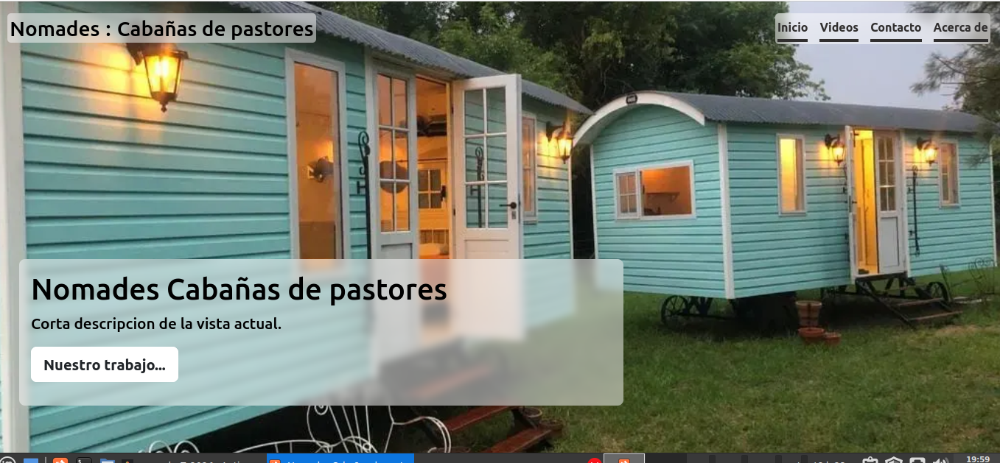
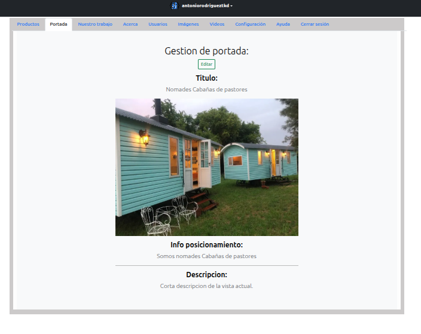
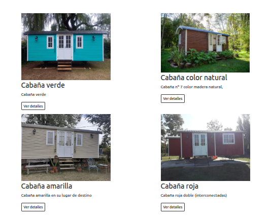
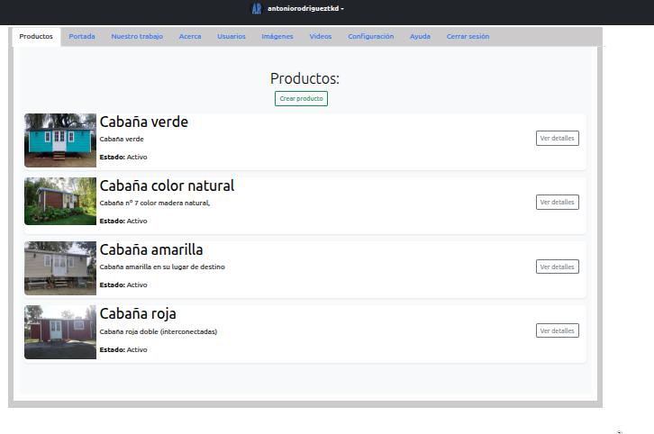

# `nomadesTs2026`

Applicación web refactorizada el dia 01-02-2026 para el sitio web de **Nomades, Cabañas de pastores**

## Nomades — Cabañas de Pastores

Sitio web completo para **Nomades, Cabañas de Pastores**, desarrollado como proyecto freelance. Incluye un frontend público para visitantes y un panel de administración completo para gestión de contenido.

> 🚀 **Demo en vivo:** `[URL del deploy]`  
> 📦 **Stack:** Express 5 · TypeScript · PostgreSQL · Sequelize · React 19 · Redux Toolkit · Vite

---

## Capturas

<!-- Reemplazá estas líneas con tus imágenes reales -->
<!-- Ejemplo:  -->


- Vista principal


- Panel de administración


- Vista de productos


- Gestión de productos

---

## Qué hace la aplicación

- **Sitio público** con página de inicio, catálogo de productos (cabañas), sección "nuestro trabajo", galería de medios (YouTube, Instagram, Facebook) y formulario de contacto.
- **Panel de administración** protegido por autenticación, con gestión completa de: portada, productos, ítems, imágenes, videos y usuarios.
- **Sistema de roles** con cuatro niveles: `USER`, `EMPLOYEE`, `MODERATOR`, `ADMIN`.
- **Gestión de imágenes** con subida a Cloudinary y limpieza automática al actualizar o eliminar registros.

---

## Arquitectura del servidor

El servidor sigue una **arquitectura en capas estricta**: cada feature tiene su propio Controller, Service y Repository, todos extendiéndose de clases base genéricas. Esto permite que agregar una nueva entidad sea predecible y sin repetición de lógica.

```
server/
├── Configs/          # DB, env, logger, CORS, error handlers
├── ExternalServices/ # Cloudinary
├── Features/         # Una carpeta por dominio (product, user, auth, ...)
│   └── product/
│       ├── ProductController.ts
│       ├── ProductService.ts
│       ├── ProductRepository.ts
│       ├── ProductMappers.ts
│       └── product.routes.ts
└── Shared/
    ├── Auth/         # Session, CSRF, middlewares de autenticación y RBAC
    ├── Controllers/  # BaseController<TDTO, TCreate, TUpdate>
    ├── Repositories/ # BaseRepository<TDTO, TCreate, TUpdate>
    └── Services/     # BaseService + BaseServiceWithImages
```

### Flujo de un request

```
HTTP Request
    → app.ts (CORS · Session · CSRF · Cookie Parser)
    → routes.ts (isAuthenticated · authorizeMinRole)
    → ProductController (extiende BaseController)
    → ProductService (extiende BaseServiceWithImages)
    → ProductRepository (extiende BaseRepository)
    → PostgreSQL / Cloudinary
```

---

## Decisiones técnicas

Estas son las decisiones no triviales del proyecto y el razonamiento detrás de cada una. Las incluyo porque creo que el código sin contexto dice la mitad.

### ¿Por qué `req-valid-express` en el backend si uso Zod en el cliente?

La decisión de incorporar `zod` en el frontend fue posterior. Cuando estructuré el backend, elegí `req-valid-express` porque resuelve tres problemas críticos en Express de forma muy declarativa: **validación, sanitización (trim, escape) y conversión de tipos en tiempo de ejecución (runtime casting)**.

Por ejemplo, si un `ProductId` viene como `"123"` en un FormData o en el query de la URL, el `type: "int"` del esquema no solo valida que sea numérico, sino que lo convierte a un `Number` real antes de que llegue al controlador. 

Dado que esta librería está diseñada como un middleware nativo para Express, resultaba sumamente ergonómica. Aunque migrar el backend a Zod para unificar la validación en ambos extremos era una opción posible, `req-valid-express` ya estaba resolviendo la validación, la sanitización y el casteo de forma sólida. Reescribir esa capa completa no justificaba el costo de tiempo frente al beneficio técnico obtenido.

### Independencia de la API: Aislando el ORM con tipos puros (Mappers)

Un problema común al usar ORMs como Sequelize es el _"Leaky Abstraction"_ (abstracción con fugas): enviar los resultados de la base de datos directamente al cliente, lo que hace que los Controladores y Servicios operen sobre instancias pesadas de la clase `Model` que incluyen estado interno y métodos como `.save()` o `.update()`.

Para evitar esto, implementé **Interfaces puras** (`IProduct`, `IUser`) y clases de **Parsers/Mappers** (`ProductParser`, `UserParser`). El ciclo funciona así:
1. El Repositorio extrae el dato real de Sequelize.
2. Inmediatamente lo pasa por el Mapper llamando a `.get({ plain: true })`.
3. El Mapper extrae únicamente los valores de negocio, y devuelve un objeto plano de JavaScript tipado con la interfaz correspondiente.

Como resultado, la capa de Servicios y los Controladores **jamás** tocan una instancia del ORM. Operan sobre objetos planos (`POJOs`) estrictamente tipados. Esto protege los datos que salen por la API REST y garantiza que cambiar a Prisma, TypeORM o **incluso migrar a una base de datos completamente distinta (ej. de PostgreSQL a MongoDB)** en un futuro afecte **únicamente** a la capa de Repositorios, manteniendo intacto el resto de la aplicación y la lógica de negocio.

### ¿Por qué Repository Pattern con Sequelize?

Podría haber llamado `Product.findAll()` directamente desde el controller — es lo más rápido. Lo evité por dos razones concretas:

1. **Testabilidad**: con el repositorio como interfaz, los tests de servicio pueden usar un mock sin tocar la base de datos real. Esto está implementado en `server/Features/product/ProductService.test.ts`.
2. **Cambio de ORM**: si en el futuro necesito reemplazar Sequelize (por TypeORM, Prisma, o una query directa), solo cambio la implementación del repositorio. El servicio y el controller no se tocan.

El costo es más archivos. Para un proyecto de este tamaño es un overhead que vale la pena.

### ¿Por qué sesiones con cookies y no JWT?

JWT es la respuesta default en muchos tutoriales para APIs REST, pero tiene un problema conocido: **no se puede invalidar un token antes de que expire**. Si un admin revoca una cuenta, el usuario con el JWT sigue autenticado hasta que venza.

Con sesiones almacenadas en la base de datos (`connect-session-sequelize`), la invalidación es inmediata: se destruye la sesión en la DB y el próximo request falla. Para una app con sistema de roles y usuarios que pueden ser bloqueados, esto es más correcto.

Por otro lado, se puede conseguir una invalidación de tokens JWT o bien un sistema con access tokens de corta duracion y refresh tokens, pero esto añade complejidad al sistema.

El tradeoff es que las sesiones requieren estado en el servidor y no escalan horizontalmente de forma trivial. Para el volumen de esta aplicación, no es un problema real.

### ¿Por qué CSRF con cookies si ya uso sesiones?

Las sesiones por sí solas protegen contra acceso no autenticado, pero no contra ataques CSRF donde un sitio malicioso hace requests en nombre de un usuario autenticado. El token CSRF (implementado con `csurf`) agrega esa capa. El cliente necesita leer el token de la cookie y enviarlo en el header — algo que un sitio externo no puede hacer por la política de Same-Origin.

### ¿Por qué `BaseServiceWithImages` separado de `BaseService`?

No todas las entidades tienen imágenes. Por ejemplo: `Media` no necesita lógica de Cloudinary. Si hubiera metido el manejo de imágenes en `BaseService`, habría forzado dependencias innecesarias en entidades que no las usan.

`BaseServiceWithImages` extiende `BaseService` y agrega solo lo que necesita: `handleImages()` y los overrides de `create`, `update` y `delete` que coordinan la operación en DB con la operación en Cloudinary.

### ¿Por qué monorepo?

La alternativa era dos repos separados (backend y frontend). El monorepo tiene ventajas concretas para este caso:

- Los **tipos de las entidades** (`IProduct`, `IUser`, etc.) están definidos una sola vez y son compartibles entre servidor y cliente sin duplicar interfaces.
- Un solo `package.json`, un solo proceso de build, un solo deploy.
- El servidor en producción sirve el build del cliente como archivos estáticos — no se necesita un servidor separado para el frontend, lo que reduce los costos de despliegue en apps pequeñas como esta.

El costo es que la configuración de TypeScript se complica (hay seis `tsconfig` distintos para server, client, tests, eslint, etc.).

---

## Seguridad implementada

| Capa | Mecanismo |
|---|---|
| Autenticación | Sesiones firmadas con `express-session` + `connect-session-sequelize` |
| Autorización | RBAC con jerarquía de roles (USER < EMPLOYEE < MODERATOR < ADMIN) |
| CSRF | `csurf` con double-submit cookie pattern |
| Contraseñas | `bcrypt` con salt rounds = 12 |
| Validación | `req-valid-express` en el servidor + `react-hook-form` + `zod` en el cliente |
| CORS | Whitelist de orígenes configurada por entorno |
| Cookies | `httpOnly: true`, `secure: true` en producción, `sameSite: 'lax'` |

---

## Testing

El proyecto tiene tres niveles de tests:

```
test/                         # Tests de integración por feature (Supertest)
  ├── Product.int.test.ts     # CRUD completo de productos e ítems
  ├── User.int.test.ts        # Registro, login, roles, bloqueo
  ├── Landing.int.test.ts
  ├── Work.int.test.ts
  ├── Media.int.test.ts
  ├── Image.int.test.ts
  └── E2E.spec.ts             # Flujo completo autenticado

server/Features/product/
  ├── ProductService.test.ts  # Tests unitarios del servicio con mock del repo
  └── ProductRepository.test.ts

server/Shared/Repositories/
  └── BaseRepository.test.ts  # Tests del repositorio base
```

```bash
npm run unit:test   # Unitarios + integración
npm run test        # E2E
```

---

## Cómo correr el proyecto localmente

### Requisitos

- Node.js 20+
- PostgreSQL corriendo localmente
- Cloudinary **no es necesario para desarrollo ni para tests** — ver más abajo

### Configuración

```bash
git clone https://github.com/antorrg/nomadesTs2026
cd nomadesTs2026
npm install
```

Copie el archivo de configuración de ejemplo:

```bash
cp config.example.json config.json
```

Edite `config.json` con sus datos locales (DB, secrets). El archivo `config.example.json` tiene la estructura completa.

### Desarrollo sin Cloudinary

En los entornos `development` y `test`, el servicio de imágenes se reemplaza automáticamente por una implementación local (`MockImgsService`) que trabaja con el sistema de archivos:

- Las imágenes subidas se guardan en `serverAssets/uploads/`
- Las imágenes de prueba para los tests viven en `serverAssets/fixtures/`
- El switch ocurre en `server/Shared/Services/ImgsService.ts` al momento de cargar el módulo:

```typescript
// ImgsService.ts — selección automática según entorno
const deleteImageByUrl = envConfig.Status !== 'production'
  ? MockImgsService.mockFunctionDelete   // desarrollo/test: filesystem local
  : deleteFromCloudinary                 // producción: Cloudinary

const selectUploaders = envConfig.Status !== 'production'
  ? MockImgsService.mockUploadNewImage
  : uploadToCloudinary
```

Cloudinary solo se configura e inicializa en producción (`server.ts` llama a `configureCloudinary()` únicamente cuando `Status === 'production'`).

### Desarrollo

```bash
npm run dev
```

Esto levanta el servidor Express con `tsx watch` y el cliente Vite con hot reload en paralelo.

### Build de producción

```bash
npm run build   # Compila cliente (Vite) y servidor (tsc)
npm start       # Levanta el servidor que sirve el build del cliente
```

---

## Variables de entorno

En producción se usa un archivo `.env`. Ver `.env.example` para la lista completa. Las variables críticas son:

| Variable | Descripción |
|---|---|
| `DATABASE_URL` | Connection string de PostgreSQL |
| `SESSION_SECRET` | Secret para firmar las sesiones (mínimo 32 chars) |
| `ROOT_EMAIL` / `ROOT_PASS` | Credenciales del usuario administrador inicial |
| `CLOUD_NAME` / `CLOUD_API_KEY` / `CLOUD_API_SECRET` | Credenciales de Cloudinary |

---

## Lo que cambiaría si lo rehaciera

Incluyo esto porque creo que entender los tradeoffs es parte del trabajo:

- **`BaseServiceWithImages` duplica algunos métodos de `BaseService`** que debería heredar sin redefinir. Es un refactor pendiente.
- **Algunos `as any` en Sequelize** son inevitables dado cómo Sequelize tipea sus modelos, pero hay algunos en lógica de negocio que podrían eliminarse con mejores interfaces.
- **El manejo de errores** evolucionó durante el proyecto — hay código comentado en `errorHandlers.ts` que debería eliminarse (está en git history si hace falta recuperarlo).

---

## Tecnologías

**Backend:** Express 5 · TypeScript · Sequelize 6 · PostgreSQL · Pino (logging) · req-valid-express · Multer · Cloudinary SDK · express-session · csurf · bcrypt

**Frontend:** React 19 · Vite 7 · Redux Toolkit · React Router 7 · React Hook Form · Zod · Axios · Bootstrap 5 · SCSS · SweetAlert2 · React Toastify

**Testing:** Vitest · Supertest

**Tooling:** ESLint · tsx · concurrently · cross-env

---

## Autor

**Antonio Rodriguez** — [@antorrg](https://github.com/antorrg)


